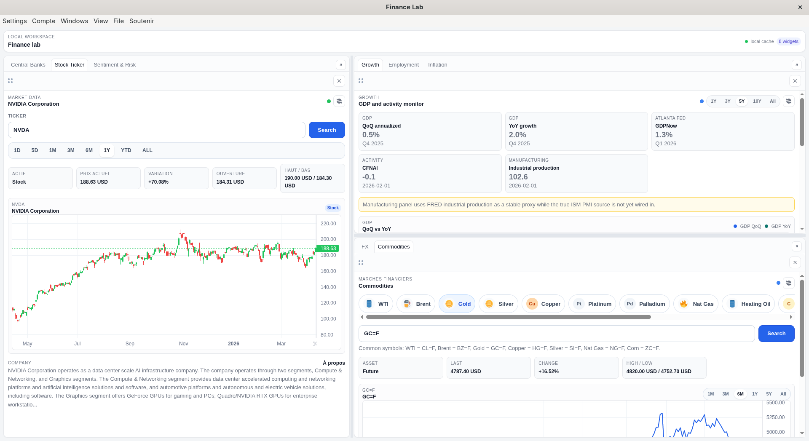

# Finance Lab

Squelette local d'application Electron pour un dashboard finance/quant modulaire.




## Prerequisites

- Node.js et npm
- Un compilateur C disponible dans le PATH (`cc`, `gcc` ou `clang`)

## Installation

```bash
npm install
```

## Launch

```bash
npm start
```

Le script :

1. compile `native/src/hello_logs.c`
2. génère `native/bin/hello_logs`
3. lance Electron

## Structure

- `src/main/`: process principal Electron
- `src/preload/`: pont sécurisé entre UI et process principal
- `src/renderer/`: interface et logique de layout
- `src/modules/`: modules chargeables dans les panneaux
- `native/`: code C compilé localement
- `scripts/`: scripts de build
