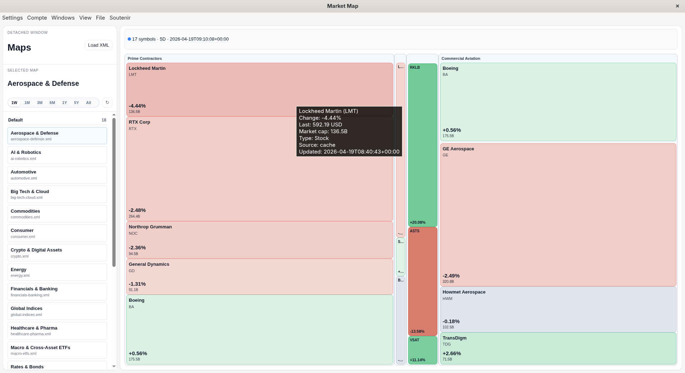

# Finance desktop developer documentation

This documentation describes the current state of the Electron desktop application in this repository. It is a developer document, not a user guide. It is intentionally explicit about implementation details, runtime behavior, interfaces, persistence, and known weaknesses.

The documentation reflects the code currently present in the repository. Some sections therefore describe technical debt and temporary design decisions that should be changed in future refactors.

Suggested reading order:

1. [System definition and architecture](./system-definition.md)
2. [Runtime and configuration](./runtime-and-configuration.md)
3. [Interfaces and data contracts](./interfaces-and-data.md)
4. [Workspace, modules, and detached windows](./workspace-and-modules.md)
5. [Frontend styling and UI conventions](./styling-and-frontend.md)
6. [Operations, testing, and maintenance](./operations-and-testing.md)
7. [Glossary](./glossary.md)

Repository entry points:

- Main process: [`src/main/main.js`](../src/main/main.js)
- Preload bridge: [`src/preload/preload.js`](../src/preload/preload.js)
- Main renderer: [`src/renderer/app.js`](../src/renderer/app.js)
- Detached market map renderer: [`src/renderer/map.js`](../src/renderer/map.js)
- Module registry: [`src/modules/index.js`](../src/modules/index.js)
- Module catalog: [`src/modules/catalog.js`](../src/modules/catalog.js)
- Python data scripts: [`scripts/`](../scripts)
- Tests: [`tests/`](../tests)

Documentation conventions:

- File paths are linked directly to the source tree where possible.
- External contracts are described as implemented now, not as intended in a hypothetical clean architecture.
- Risks and non-ideal patterns are called out explicitly.

