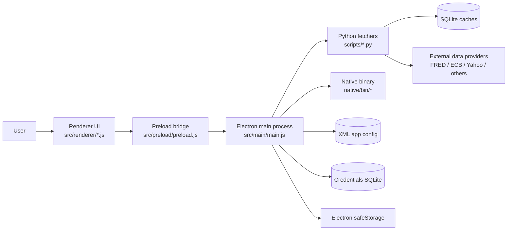
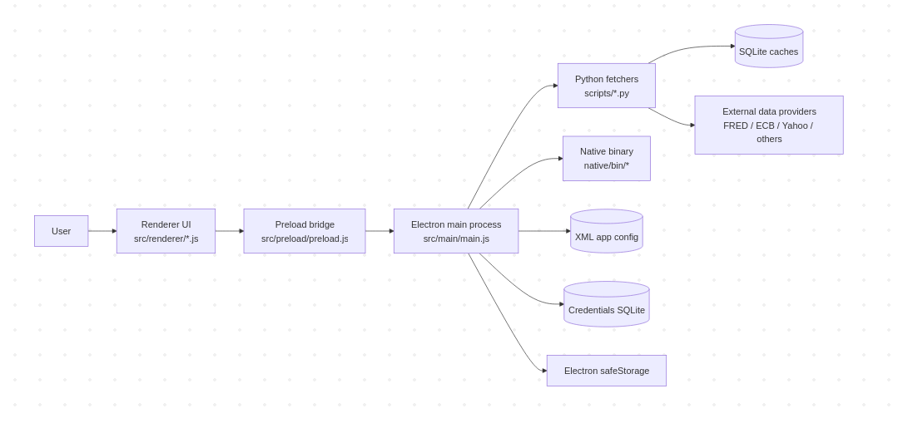

# System definition and architecture

## Purpose

The application is a local-first desktop macro and market research workstation implemented with Electron. It combines:

- a dynamic widget workspace in the main window
- detached utility windows such as the market map
- local caching and persistence
- Python data fetchers for financial and macroeconomic datasets
- a credentials manager backed by local SQLite and Electron secure storage

The intended outcome is a configurable research desk for monitoring:

- central banks
- inflation
- employment
- growth
- FX
- commodities
- equity and ETF tickers
- risk and sentiment
- custom stock maps

## Scope boundaries

The current codebase includes:

- Electron desktop shell
- native menubar integration
- dynamic renderer widgets
- detached map window
- local XML config persistence
- local SQLite caches for fetched data
- local encrypted credential storage for API keys and secrets
- integration with FRED, ECB, Yahoo Finance, CNN, and other public data sources

The current codebase does not include:

- a backend server
- user accounts or cloud synchronization
- a stable plugin system
- formal API versioning between components
- CI/CD pipelines
- staging or production deployment environments in the classic web sense
- comprehensive automated test coverage

## Non-goals

At the moment, the project is not trying to be:

- a multi-user SaaS platform
- a secure remote trading system
- a normalized market data warehouse
- a strict design-system-driven frontend
- a fully sandboxed Electron application

The `no-sandbox` Electron flags in [`src/main/main.js`](../src/main/main.js) are a concrete example of a current implementation choice that works for local development but should not be treated as a long-term security baseline.

## High-level architecture

The application is structured as four cooperating layers:

1. Electron main process
2. Electron preload bridge
3. Renderer modules
4. Python data fetchers and local SQLite stores

High-level responsibilities:

- Main process
  - owns application windows
  - owns native menus
  - persists app config
  - invokes Python scripts
  - encrypts and decrypts credential fields through `safeStorage`
  - exposes IPC handlers

- Preload
  - exposes a curated `window.financeDesktop` API to renderers
  - prevents direct renderer access to Node/Electron internals

- Renderer
  - renders widgets and workspace layout
  - performs local UI state management
  - requests data through preload IPC
  - injects module-specific CSS dynamically

- Python scripts
  - fetch remote data
  - normalize payloads
  - cache results in SQLite
  - return JSON on stdout

## Interaction model

The dominant interaction pattern is request/response over IPC:

- renderer calls `window.financeDesktop.<method>()`
- preload forwards to `ipcRenderer.invoke(...)`
- main process handles via `ipcMain.handle(...)`
- main process may spawn Python
- Python prints JSON
- main parses stdout and returns JSON back to renderer

This model is synchronous from the renderer caller perspective, but asynchronous end-to-end.

The app also uses event-driven patterns for a few flows:

- native menu to renderer events such as `ui:open-credentials`
- config broadcast updates such as `ui:app-config-updated`
- drag/drop and resize events in the workspace renderer

## Architecture diagram

<!--  -->

## Codebase structure

Top-level directories:

- [`src/main`](../src/main)
  - Electron main process code
- [`src/preload`](../src/preload)
  - renderer bridge API
- [`src/renderer`](../src/renderer)
  - HTML, shared CSS, detached-window renderers, workspace runtime
- [`src/modules`](../src/modules)
  - widget implementations and registry
- [`src/utils`](../src/utils)
  - small helpers such as stylesheet injection
- [`scripts`](../scripts)
  - Python fetchers and credential store CLI
- [`native`](../native)
  - native binary source and build outputs
- [`tests`](../tests)
  - Python unit tests, currently minimal
- [`docs/maps`](./maps)
  - example XML map definitions

## Architectural strengths

- clear separation between main process and renderer access through preload
- local-first persistence model
- widget system can evolve incrementally
- Python fetchers isolate external data normalization from renderer code
- detached windows are already possible without affecting the main workspace

## Architectural weaknesses and future refactor targets

- too much logic is concentrated in [`src/main/main.js`](../src/main/main.js)
- renderer workspace logic in [`src/renderer/app.js`](../src/renderer/app.js) is large and should be split
- data interfaces are implicit JSON contracts rather than shared typed schemas
- fetchers use inconsistent implementation styles across scripts
- there is no common formal error envelope across all IPC endpoints
- app configuration uses ad hoc XML attribute parsing rather than a stronger config model
- many modules are stateful but do not have explicit mount/unmount lifecycle contracts
- CSS is only partially modularized

These weaknesses should be treated as active refactor opportunities, not hidden implementation details.
